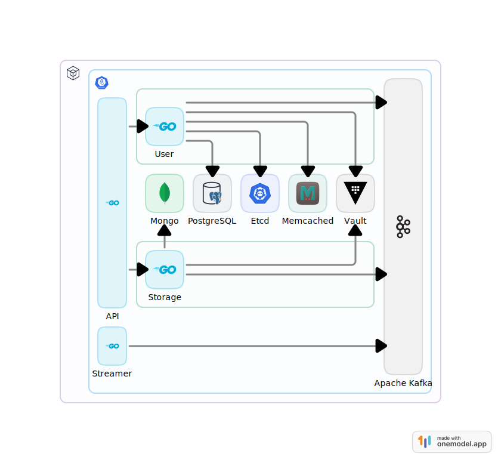

# stalker 🕵🏽‍♂️
A highly available distributed chat application

## Tech Stack 🚀

**Languages 🌐:** Golang

**Data Transformation Protocols ✉️:** gRPC, WS, REST

**Broker 📑:** Kafka

**Containerization 📦:** K8s, Docker, Docker compose

**Secrets 🧰:** Vault, JWT

**Database/Cache 📚:** Mongo, Memcache

**CI/CD  🛠:** Build, Test

## Architecture  🏗

⠀
